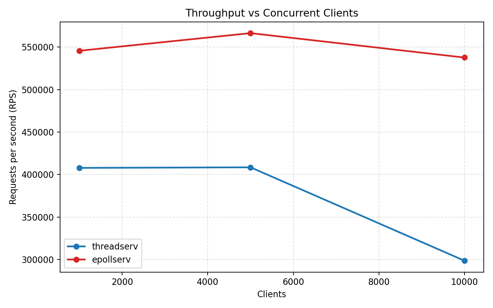
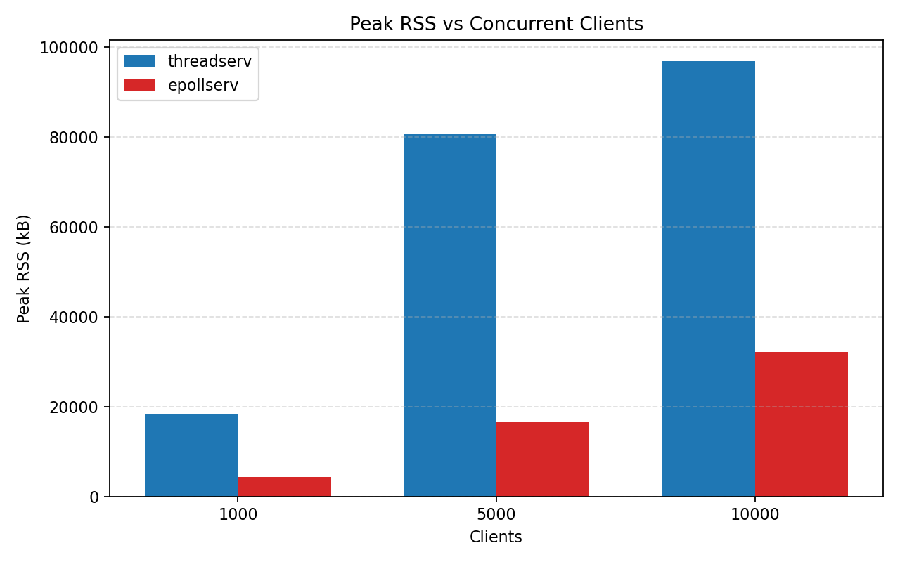

---
header-includes:
  - \usepackage{float}
  - \usepackage[section]{placeins}
---

# CMPE476 C10K Benchmark Report

## 1. Test Setup

- Machine: ASUS - System Product Name
- CPU / RAM / Swap: 12 vCPU / 16211 MB RAM / 4096 MB swap
- OS and kernel: Ubuntu on WSL2 (`Linux Duran-Desktop 6.6.87.2-microsoft-standard-WSL2`)
- `ulimit -n`: **65535** (set before the benchmark run)
- Any `sysctl` tuning: none

## 2. Methodology

- Build command: `make clean && make && make client_flood`
- Load generator: `client_flood`
- Target concurrency: `1000`, `5000`, `10000`
- Requests per client: `100`
- Host: `127.0.0.1`
- For each server (`threadserv`, `epollserv`) and concurrency level:
  - launch server
  - run `client_flood <host> <port> <clients> <requests_each>`
  - record throughput from `client_flood` output
  - sample `/proc/<pid>/status` during active load and record **peak VmRSS**
  - stop server

## 3. Results Table

| Server | Clients | Requests Each | Comptd. Rqsts. | Elapsed (s) | RPS | RSS Before (kB) | Peak RSS (kB) | RSS After (kB) |
|---|---:|---:|---:|---:|---:|---:|---:|---:|
| t.serv | 1000 |100 |100000 |0.245 | 407862| 1408|18304 |3904 |
| t.serv | 5000 |100 |500000 | 1.224|408514 | 1408|80640 | 7208|
| t.serv | 10000 | 100|1000000 |3.348 |298691 |1408 |96768 |8532 |
| epollserv | 1000 | 100|100000 | 0.183| 545564| 1408|4352 |3492 |
| epollserv | 5000 |100| 500000 |0.883 | 566296| 1408|16512 |11632 |
| epollserv | 10000 |100 |1000000 |1.860 | 537594| 1408|32128 | 32128|

## 4. Charts

### Throughput vs Clients 

{latex-placement="H" width=85%}

### Peak RSS vs Clients 

{latex-placement="H" width=85%}

## 5. Analysis

Throughput shows a clear split between the two designs: `threadserv` is roughly flat from 1k to 5k clients (around 408k RPS) but drops noticeably at 10k (around 299k RPS), so thread per connection starts to degrade at high concurrency. `epollserv` stays both faster and steadier (about 546k, 566k, and 538k RPS), which is expected because nonblocking `epoll` avoids creating/scheduling thousands of threads. Memory tells the same story: peak RSS for `threadserv` rises sharply (18,304 -> 80,640 -> 96,768 kB), while `epollserv` stays much lower (4,352 -> 16,512 -> 32,128 kB), so the event-loop model scales better in both throughput and memory at 10k clients.

## 6. Limitation

The benchmark runs on localhost (WSL2 loopback), so it does not include real network effects such as latency, packet loss, or cross-machine variability; results on a real network may differ.
